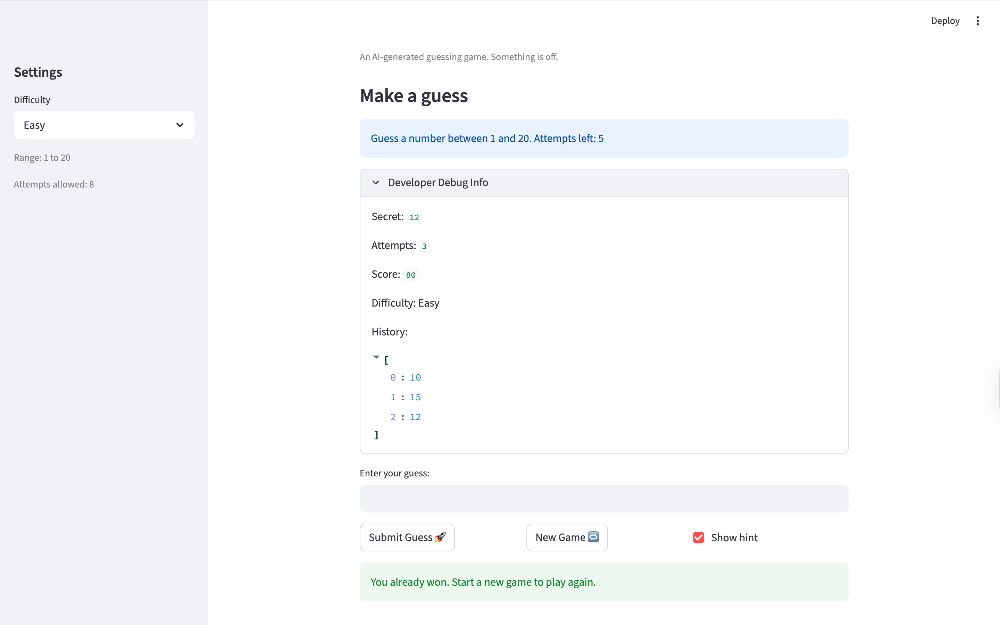

# 🎮 Game Glitch Investigator: The Impossible Guesser

## 🚨 The Situation

You asked an AI to build a simple "Number Guessing Game" using Streamlit.
It wrote the code, ran away, and now the game is unplayable. 

- You can't win.
- The hints lie to you.
- The secret number seems to have commitment issues.

## 🛠️ Setup

1. Install dependencies: `pip install -r requirements.txt`
2. Run the broken app: `python -m streamlit run app.py`

## 🕵️‍♂️ Your Mission

1. **Play the game.** Open the "Developer Debug Info" tab in the app to see the secret number. Try to win.
2. **Find the State Bug.** Why does the secret number change every time you click "Submit"? Ask ChatGPT: *"How do I keep a variable from resetting in Streamlit when I click a button?"*
3. **Fix the Logic.** The hints ("Higher/Lower") are wrong. Fix them.
4. **Refactor & Test.** - Move the logic into `logic_utils.py`.
   - Run `pytest` in your terminal.
   - Keep fixing until all tests pass!

## 📝 Document Your Experience

- [ ] Describe the game's purpose.

The purpose of the game is for the player to guess a secret number within a certain range based on the difficulty level. The player receives hints after each guess and must find the correct number before running out of attempts. The game also tracks attempts and a score that decreases with each guess.

-[ ] Detail which bugs you found.

The hints were backwards. When the guess was too high it would say to go higher instead of lower, and vice versa.

Restarting the game did not properly reset the game state. The game would freeze and the attempts and scores would not restart correctly.

The random number ranges (1–50, and 1–100) were incorrect for the difficulty levels.

The “Show Hint” checkbox did not always display hints at the correct time.

When a user entered a guess, the number stayed in the input box instead of clearing for the next guess.

The score and attempt system did not update correctly and the patterns did not line up with the difficulty levels.

- [ ] Explain what fixes you applied.

Fixed the hint logic so the game correctly tells the player to go higher or lower depending on the guess.

Corrected the random number ranges (1–50, and 1–100) so they match the correct difficulty levels.

Adjusted the attempt limits so the difficulty levels are more balanced.

Improved the “Show Hint” behavior so hints display correctly after a guess.

Reset the input field after each guess so the player can easily enter a new number.

Simplified the scoring system so the score starts higher and decreases with each attempt.

## 📸 Demo

- [ ] [Insert a screenshot of your fixed, winning game here]

## 🚀 Stretch Features

- [ ] [If you choose to complete Challenge 4, insert a screenshot of your Enhanced Game UI here]
